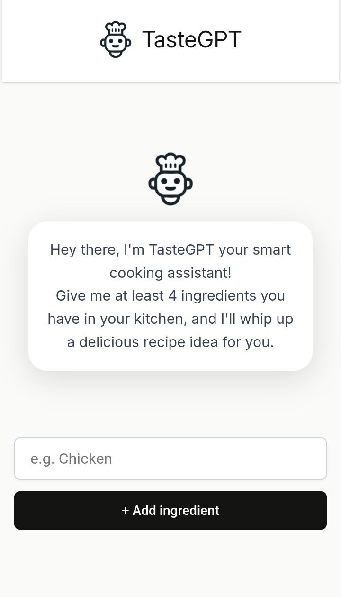

# 🍳 TasteGPT - AI-Powered Recipe Generator

<div align="center">
  
  <br>
  <em>Your smart cooking assistant that transforms available ingredients into delicious recipe ideas!</em>
</div>

[](https://reactjs.org/)
[](LICENSE)
[]()

> **Your smart cooking assistant that transforms available ingredients into delicious recipe ideas!**

## ✨ Features

- **🤖 AI-Powered Recipe Generation**: Uses advanced AI models to create personalized recipes
- **📱 Responsive Design**: Optimized for all devices - desktop, tablet, and mobile
- **⚡ Real-time Processing**: Instant recipe generation with loading indicators
- **🎯 Ingredient Management**: Easy ingredient input and management system
- **🎨 Modern UI/UX**: Clean, intuitive interface with smooth animations
- **📱 Mobile-First**: Fully responsive design that works on all screen sizes

## 🚀 Live Demo

**[Try TasteGPT Live](https://taste-gpt.netlify.app/)**

## 🛠️ Tech Stack

- **Frontend**: React 19.1.0, CSS3
- **AI Integration**: Anthropic Claude API, Hugging Face Inference
- **Styling**: Custom CSS with responsive design
- **Build Tool**: Create React App
- **Deployment**: Ready for Vercel, Netlify, or any static hosting

## 📱 Screenshots

### Desktop View


### Mobile View


## 🚀 Getting Started

### Prerequisites

- Node.js (v16 or higher)
- npm or yarn
- API keys for AI services

### Installation

1. **Clone the repository**

   ```bash
   git clone https://github.com/000Shehab000/TasteGPT.git
   cd TasteGPT
   ```

2. **Install dependencies**

   ```bash
   cd app
   npm install
   ```

3. **Set up environment variables**

   ```bash
   # Create .env file in the app directory
   cp .env.example .env

   # Add your API keys
   REACT_APP_ANTHROPIC_API_KEY=your_anthropic_key
   REACT_APP_HUGGINGFACE_API_KEY=your_huggingface_key
   ```

4. **Start the development server**

   ```bash
   npm start
   ```

5. **Open your browser**
   Navigate to `http://localhost:3000`

## 🔧 Configuration

### Environment Variables

| Variable                        | Description              | Required |
| ------------------------------- | ------------------------ | -------- |
| `REACT_APP_ANTHROPIC_API_KEY`   | Anthropic Claude API key | Yes      |
| `REACT_APP_HUGGINGFACE_API_KEY` | Hugging Face API key     | Yes      |

### API Setup

1. **Anthropic Claude**: Get your API key from [Anthropic Console](https://console.anthropic.com/)
2. **Hugging Face**: Get your API key from [Hugging Face](https://huggingface.co/settings/tokens)

## 📁 Project Structure

```
TasteGPT/
├── app/
│   ├── public/
│   │   ├── index.html
│   │   └── favicon.ico
│   ├── src/
│   │   ├── components/
│   │   │   ├── Header.js
│   │   │   ├── Main.js
│   │   │   ├── IngredientsList.js
│   │   │   └── ClaudeRecipe.js
│   │   ├── ai.js
│   │   ├── App.js
│   │   ├── App.css
│   │   └── index.js
│   ├── package.json
│   └── README.md
└── README.md
```

## 🎯 How It Works

1. **Input Ingredients**: Users add ingredients they have available
2. **AI Processing**: The app sends ingredients to AI models for recipe generation
3. **Recipe Generation**: AI creates personalized recipes based on available ingredients
4. **Display Results**: Beautifully formatted recipes are displayed to users

## 🔒 Security Features

- API keys are stored securely in environment variables
- No sensitive data is exposed in client-side code
- Input validation and sanitization
- Error handling for API failures

## 📱 Responsive Design

The application is built with a mobile-first approach and includes:

- **Breakpoints**: 480px, 768px, and 1200px
- **Flexbox Layout**: Adaptive layouts for different screen sizes
- **Touch-Friendly**: Optimized for mobile interactions
- **Performance**: Optimized loading and rendering

## 🚀 Deployment

### Vercel (Recommended)

1. **Install Vercel CLI**

   ```bash
   npm i -g vercel
   ```

2. **Deploy**
   ```bash
   cd app
   vercel
   ```

### Netlify

1. **Build the project**

   ```bash
   npm run build
   ```

2. **Drag and drop** the `build` folder to Netlify

### Manual Deployment

1. **Build the project**

   ```bash
   npm run build
   ```

2. **Upload** the `build` folder to your hosting provider

## 🤝 Contributing

We welcome contributions! Please follow these steps:

1. Fork the repository
2. Create a feature branch (`git checkout -b feature/AmazingFeature`)
3. Commit your changes (`git commit -m 'Add some AmazingFeature'`)
4. Push to the branch (`git push origin feature/AmazingFeature`)
5. Open a Pull Request

## 📝 License

This project is licensed under the MIT License - see the [LICENSE](LICENSE) file for details.

## 🙏 Acknowledgments

- **Anthropic** for Claude AI API
- **Hugging Face** for inference API
- **React Team** for the amazing framework
- **Open Source Community** for inspiration and tools

## 📞 Contact

- **LinkedIn**: [Shehab Gamal El-Deen](https://www.linkedin.com/in/shehab-gamal-el-deen/)

## 📊 Project Status

- ✅ **Core Features**: Complete
- ✅ **Responsive Design**: Complete
- ✅ **AI Integration**: Complete
- ✅ **Error Handling**: Complete
- 🔄 **Performance Optimization**: In Progress
- 🔄 **Additional AI Models**: Planned

---

**Made with ❤️ by [Shehab Gamal El-Deen]**

_Star this repository if you found it helpful! ⭐_
